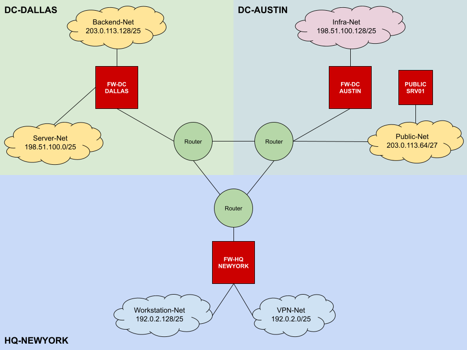

# Working Firewall Example

This directory contains all files required for a working arculus-fire.io example.

## Reference Network Layout



Our sample network operates three IPv4 prefixes 192.0.2.0/24, 198.51.100.0/24 and 203.0.113.0/24. They are assigned as smaller subnets across three sites. All subnets are located behind central forwarding firewalls except one public server net which is directly connected to one of the routers. Our [firewall definition](firewalls.yml) contains all three central firewalls as well as one server located inside the public-servers-net, running a local nftables firewall.

## How To Generate Rulesets

The [arculus-fire.io.conf](../arculus-fire.io.conf) file already points to the example files in this directory. Once you have setup the runtime environment (see [README.md](../README.md)) you can run the following commands to generate the output files according to the firewall type set in [firewalls.yml](firewalls.yml):
```shell
./parser.py
./generator.py
```

You will find the output files in `output/firewalls`.